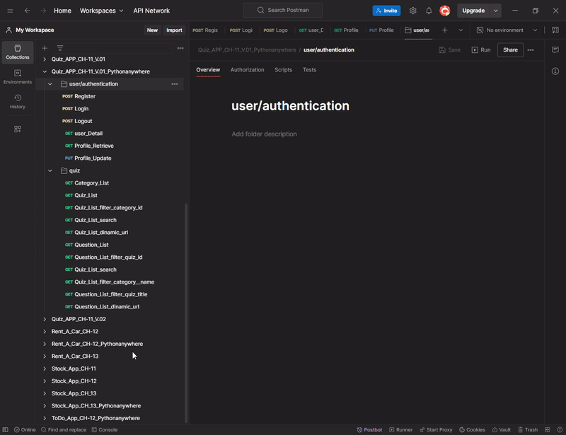
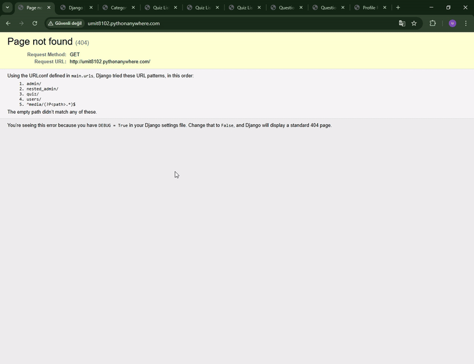
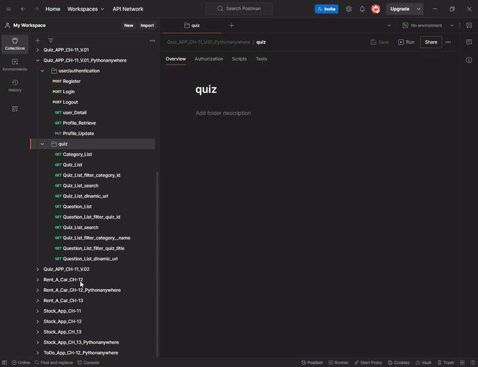
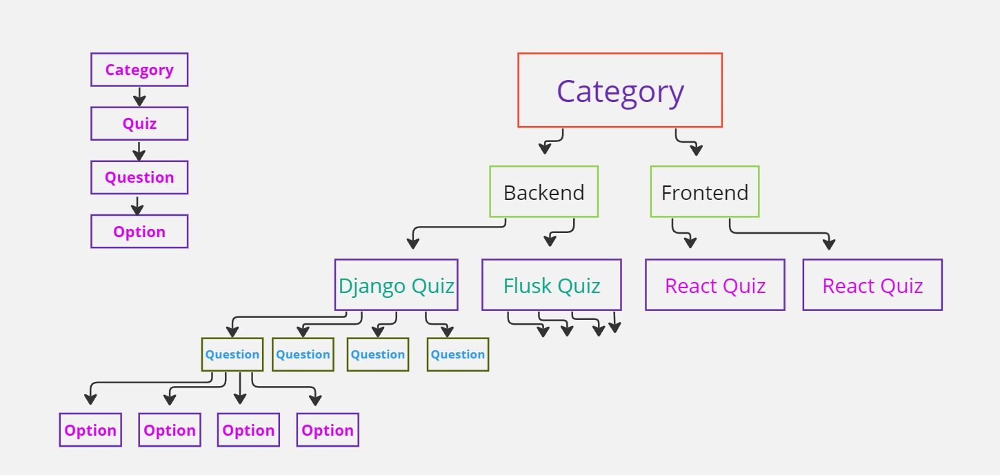

<!-- Please update value in the {}  -->

<h1 align="center">Project_Django_Rest_Framework_Quiz_App</h1>


<!-- <div align="center">
  <h3>
    <a href="http://umit8102.pythonanywhere.com/">
      Demo
    </a>
     | 
    <a href="http://umit8102.pythonanywhere.com/">
      Project
    </a>
 
  </h3>
</div> -->

<!-- TABLE OF CONTENTS -->

## Table of Contents

- [Table of Contents](#table-of-contents)
- [API Endpoints](#api-endpoints)
  - [User/Authentication Endpoints:](#userauthentication-endpoints)
  - [Quiz Endpoints:](#quiz-endpoints)
- [API Testing](#api-testing)
- [Overview](#overview)
  - [Kullanıcı Doğrulama Testi](#kullanıcı-doğrulama-testi)
  - [Quiz App Test](#quiz-app-test)
  - [Quiz App Project Schema](#quiz-app-project-schema)
- [Built With](#built-with)
- [How To Use](#how-to-use)
- [About This Project](#about-this-project)
- [Acknowledgements](#acknowledgements)
- [Contact](#contact)

<!-- OVERVIEW -->

## API Endpoints

Bu API aşağıdaki endpoint'leri sağlar:

### User/Authentication Endpoints:

| Method | URL                                                          | Açıklama            |
|--------|--------------------------------------------------------------|---------------------|
| POST   | `https://umit8102.pythonanywhere.com/users/register/`        | Yeni kullanıcı kaydı|
| POST   | `https://umit8102.pythonanywhere.com/users/auth/login/`      | Kullanıcı girişi    |
| POST   | `https://umit8102.pythonanywhere.com/users/auth/logout/`     | Kullanıcı çıkışı    |


### Quiz Endpoints:

| Method | URL                                                                   | Açıklama                             |
|--------|-----------------------------------------------------------------------|--------------------------------------|
| GET    | `https://umit8102.pythonanywhere.com/quiz/`                           | Tüm Quiz Kategorilerini listele      |
| GET    | `https://umit8102.pythonanywhere.com/quiz/quiz`                       | Tüm Kategorilerin quizlerini listele |
| GET    | `https://umit8102.pythonanywhere.com/quiz/question/`                  | Tüm quizlerin sorularını listele     |
| GET    | `https://umit8102.pythonanywhere.com/quiz/quiz/?search=angu`          | quiz search                          |
| GET    | `https://umit8102.pythonanywhere.com/quiz/question/?quiz__title=React`| quiz filter                          |


## API Testing

Postman Collection, API'nizin her bir endpoint'ini test etmek için gerekli istekleri içerir. API'nin işlevselliğini hızlı bir şekilde anlamak için kullanabilirsiniz.

API'leri Postman üzerinden test etmek için aşağıdaki adımları izleyebilirsiniz:

1. Postman'i yükleyin (eğer yüklü değilse): [Postman İndir](https://www.postman.com/downloads/).
2. Bu [Postman Collection](https://umit-dev.postman.co/workspace/Team-Workspace~7e9925db-bf34-4ab9-802e-6deb333b7a46/collection/17531143-e7678a3c-288b-4c80-b639-b1a1b6b42051?action=share&creator=17531143) indirin ve içe aktarın.
3. API'leri Postman üzerinden test etmeye başlayın.

**Postman Collection Linki:**  
[Blog App API Postman Collection](https://umit-dev.postman.co/workspace/Team-Workspace~7e9925db-bf34-4ab9-802e-6deb333b7a46/collection/17531143-e7678a3c-288b-4c80-b639-b1a1b6b42051?action=share&creator=17531143)


## Overview

### Kullanıcı Doğrulama Testi
<!--  -->

➡ *Kullanıcı doğrulama işlemleri için Postman üzerinde yapılan test sürecini görebilirsiniz.*

---

<!--  -->


---

### Quiz App Test
<!--  -->

➡ *Blog API'sini Postman ile test etme.*

---

### Quiz App Project Schema
<!--  -->


## Built With

<!-- This section should list any major frameworks that you built your project using. Here are a few examples.-->

Bu proje aşağıdaki araçlar ve kütüphanelerle inşa edilmiştir:
- [Django Rest Framework](https://www.django-rest-framework.org/) - Güçlü bir REST API framework'ü.
- [dj-rest-auth](https://dj-rest-auth.readthedocs.io/en/latest/) - Kullanıcı yetkilendirme modülü.
- [django-nested-admin](https://django-nested-admin.readthedocs.io/en/latest/)
- [django-filter](https://django-filter.readthedocs.io/en/stable/)


## How To Use

<!-- This is an example, please update according to your application -->

To clone and run this application, you'll need [Git](https://github.com/Umit8098/Project_Django_Rest_Framework_Quiz_App_CH-11_V.01.git) 

When installing the required packages in the requirements.txt file, review the package differences for windows/macOS/Linux environments. 

Complete the installation by uncommenting the appropriate package.

---

requirements.txt dosyasındaki gerekli paketlerin kurulumu esnasında windows/macOS/Linux ortamları için paket farklılıklarını inceleyin. 

Uygun olan paketi yorumdan kurtararak kurulumu gerçekleştirin. 

```bash
# Clone this repository
$ git clone https://github.com/Umit8098/Project_Django_Rest_Framework_Quiz_App_CH-11_V.01.git

# Install dependencies
    $ python -m venv env
    $ python -m venv env (for macOs/linux OS)
    $ env/Scripts/activate (for win OS)
    $ source env/bin/activate (for macOs/linux OS)
    $ pip install -r requirements.txt
    $ python manage.py migrate (for win OS)
    $ python3 manage.py migrate (for macOs/linux OS)

# Create and Edit .env
# Add Your SECRET_KEY in .env file

"""
# example .env;

SECRET_KEY =123456789abcdefg...
"""

# Run the app
    $ python manage.py runserver
```

## About This Project
- Quiz Application API service.
- Using the django-nested-admin package in the admin panel.

<hr>

- Quiz Application API service.
- admin panelde django-nested-admin paketi kullanımı.

## Acknowledgements
- [Django Rest Framework](https://www.django-rest-framework.org/)
- [django-nested-admin](https://django-nested-admin.readthedocs.io/en/latest/)
- [dj-rest-auth](https://dj-rest-auth.readthedocs.io/en/latest/)
- [django-filter](https://django-filter.readthedocs.io/en/stable/)


## Contact

<!-- - Website [your-website.com](https://{your-web-site-link}) -->
- GitHub [@Umit8098](https://github.com/Umit8098)

- Linkedin [@umit-arat](https://linkedin.com/in/umit-arat/)
<!-- - Twitter [@your-twitter](https://{twitter.com/your-username}) -->
